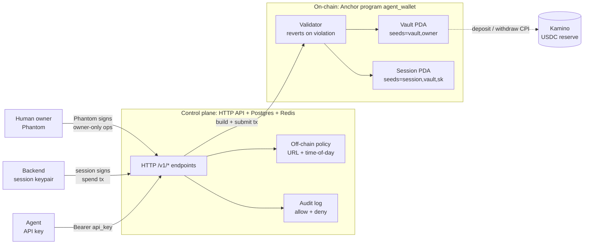

<div align="center">


# Klink

**A non-custodial Solana smart-wallet for AI agents.**
On-chain policy DSL · spend caps · allowlists · audit trail by default.

[](https://solana.com)
[](https://www.anchor-lang.com/)
[](https://bun.sh)
[](https://nextjs.org)
[](https://www.colosseum.org)

**Live:** [app.klinkdotfun.live](https://app.klinkdotfun.live) · **API:** [api.klinkdotfun.live](https://api.klinkdotfun.live) · **Agent skill:** [skill.md](https://app.klinkdotfun.live/skill.md)

<!-- DEMO_VIDEO_URL: paste your demo video link here -->

</div>

---

## The problem

AI agents are getting wallets faster than they're getting guardrails. Today's options are bad:

- **Hand them a hot key.** One prompt injection drains the wallet (cf. the Drift agent-wallet incident).
- **Custodial SaaS wallets (Locus / Skyfire on Base).** Server-side policy. Regulator exposure. You trust the provider's runtime, not the chain.
- **Squads v4 spend limits.** Human-multisig shaped — not built for one-human / one-agent / many-API-calls-per-minute.

What's missing is a Solana-native primitive where **the policy lives on-chain** and the agent never holds keys that can drain the vault.

## What Klink does

Klink is a three-actor wallet with a hard trust boundary:

| Actor | Holds | Authority | If credential leaks |
|---|---|---|---|
| **Human owner** | Phantom keypair (on-device) | Master — configures policy, funds wallet, revokes sessions | Total loss (same as any Solana wallet) |
| **Backend** | Session keypair (encrypted at rest, AES-256-GCM) | Delegated co-signer, subject to on-chain policy | Bounded by `daily_cap` × time-to-revoke + recipient/program allowlists |
| **Agent** | Bearer API key only | Zero on-chain power; HTTP-only to the backend | Bounded by the session it's bound to; revoke-from-dashboard |

The agent never crosses below the backend. The session keypair never leaves the backend. The owner key never leaves the human's device. The Anchor program reverts any tx that violates the on-chain policy floor.

## Features

- **On-chain policy floor.** `max_per_tx`, `daily_cap`, recipient allowlist (10 slots), program allowlist, session expiry, `max_deployed_fraction_bp` — all enforced by the `agent_wallet` Anchor program. Tx reverts on violation, no exceptions.
- **Off-chain rich rules.** URL allowlist + time-of-day windows enforced by the backend before signing.
- **Audit-by-default.** Solana tx history is the source of truth — free, immutable, queryable from any RPC. Off-chain enrichment adds allow/deny reasons for denied attempts.
- **Manual Kamino yield.** Owner-triggered deposit/withdraw to the Kamino main USDC reserve via CPI. No background workers acting on user funds.
- **Two funding paths.** Direct USDC transfer (any Solana wallet) and Dodo Payments fiat-in via a treasury bridge with idempotent webhooks.
- **Service spending.** Curated mpp.dev catalog (proxied, the catalog ships with Klink) and user-registered x402 endpoints with sign-only relay — agent quotes the upstream 402, backend signs, you forward the proof.
- **Agent skill.** A self-onboarding `skill.md` lets an LLM-agent integrate Klink without human-authored glue.
- **Typed TypeScript SDK.** `@klink/sdk` wraps every agent-authenticated endpoint with zero runtime deps.

## Architecture

Three layers, three actors, hybrid policy: hard limits on-chain, rich rules off-chain.



Full architecture write-up: [`gitbook/architecture/overview.md`](gitbook/architecture/overview.md). Design spec: [`docs/specs/2026-04-28-agent-wallet-design.md`](docs/specs/2026-04-28-agent-wallet-design.md).

### Spend flow (the hot path)

1. Agent calls `POST /v1/spend/...` with `Authorization: Bearer <api_key>`.
2. Backend resolves the wallet + session, runs off-chain policy (URL allowlist, time window).
3. Backend builds the typed instruction and signs with the session keypair.
4. Submits to Solana — the `agent_wallet` program re-checks every on-chain rule and reverts on violation.
5. Backend writes the off-chain audit row (allow or deny with reason).

## Tech stack

| Layer | Stack |
|---|---|
| **On-chain** | Rust · Anchor 1.0 · Solana 3.x · USDC (SPL) · Kamino CPI |
| **Backend (`apps/api`)** | Bun · TypeScript · Express · Drizzle ORM · Postgres · Redis |
| **Dashboard (`apps/web`)** | Next.js 14 (App Router) · React · Tailwind · shadcn/ui · `@solana/wallet-adapter` · SWR |
| **SDK (`packages/sdk`)** | TypeScript · zero runtime deps · injectable `fetch` for tests |
| **Tooling** | Bun workspaces · Biome (lint/format) · drizzle-kit · puppeteer (e2e) |

### Repo layout

```
.
├── programs/agent_wallet/      Anchor program (Rust) — vault PDA, sessions, transfer_usdc, Kamino CPI
├── apps/
│   ├── api/                    Bun + Express backend, /v1/* surface, off-chain policy, Dodo webhook
│   └── web/                    Next.js 14 dashboard, SIWS auth, sessions/allowlist editor, audit, yield
├── packages/sdk/               @klink/sdk — typed TS client for AI-agent developers
├── docs/
│   ├── specs/                  Frozen design spec (source of truth on architecture)
│   ├── architecture/           HTTP API surface, deeper notes
│   ├── runbooks/               Dev environment, deploys, team collaboration
│   └── memos/                  Decision memos
├── gitbook/                    Public docs site source (concepts, architecture, services, skill.md)
├── migrations/                 SQL migrations
├── scripts/                    Repo automation
├── TODO.md                     Async task board — claim T-XXX before starting
├── CLAUDE.md / AGENTS.md       Conventions for AI contributors
└── CONTEXT.md                  Strategic framing + locked architecture decisions
```

## Live links

| Surface | URL |
|---|---|
| Dashboard (humans) | <https://app.klinkdotfun.live> |
| HTTP API (agents) | <https://api.klinkdotfun.live> |
| Agent skill (LLM-readable) | <https://app.klinkdotfun.live/skill.md> |
| Services catalog (markdown) | <https://app.klinkdotfun.live/services/mpp.md> |
| Devnet program id | `DPPE8TAuw5qyWbw5MqcXcAtH2d5RYF5XBXTiN2pKzM3L` |

## Quickstart (developers)

Prerequisites: Bun ≥ 1.1, Rust + Solana CLI + Anchor 1.0 (only if you touch the program), Postgres 15, Redis. Full setup in [`docs/runbooks/dev-environment.md`](docs/runbooks/dev-environment.md).

```bash
git clone https://github.com/manjeetsharma0796/klink.git
cd klink
bun install

# Backend (http://localhost:3000)
cp apps/api/.env.example apps/api/.env
# edit DATABASE_URL + REDIS_URL + JWT_SECRET
bun --filter @klink/api dev

# Dashboard (http://localhost:3030)
cp apps/web/.env.local.example apps/web/.env.local
bun --filter @klink/web dev

# Run all tests
bun --filter '*' test
```

## SDK example — give an agent a wallet in 10 lines

```ts
import { KlinkClient } from "@klink/sdk";

const klink = new KlinkClient({
  baseUrl: "https://api.klinkdotfun.live",
  apiKey: process.env.KLINK_API_KEY!, // generated in the dashboard
});

// 1) Direct on-chain transfer (subject to caps + allowlist)
await klink.spendTransfer({
  recipient: "9muAwR8a4LEgFGLNPfoUHhJrfLmtkXFBvpBQCx2GLVTU",
  amount: 5_000_000,           // 5 USDC (base units)
  memo: "invoice-2026-05-12",
});

// 2) Pay a curated mpp.dev service with a hard quote ceiling
await klink.spendService({
  slug: "anthropic-claude",
  path: "/v1/messages",
  method: "POST",
  body: { model: "claude-haiku-4.5", messages: [/* ... */] },
  max_amount: 10_000,          // 0.01 USDC ceiling
});

// 3) Manual yield
await klink.yieldDeposit({ amount: 100_000_000 });
```

Full SDK docs: [`packages/sdk/README.md`](packages/sdk/README.md).

## Roadmap

| Milestone | Status |
|---|---|
| Design spec frozen | ✅ done — [`docs/specs/2026-04-28-agent-wallet-design.md`](docs/specs/2026-04-28-agent-wallet-design.md) |
| Anchor program (`agent_wallet`) on devnet | ✅ deployed — `DPPE8TAuw5qyWbw5MqcXcAtH2d5RYF5XBXTiN2pKzM3L` |
| Backend `/v1/*` surface | ✅ live — `api.klinkdotfun.live` |
| Dashboard (SIWS, sessions, allowlist, audit, yield, fund) | ✅ live — `app.klinkdotfun.live` |
| TypeScript SDK (`@klink/sdk`) | ✅ in-tree, npm publish pending |
| Kamino main USDC reserve (manual) | ✅ devnet |
| Dodo Payments fiat-in (devnet) | ✅ wired |
| External audit (`T-115`) | ⏳ pending — gating mainnet deploy |
| Mainnet | ⏳ post-audit |
| Auto-yield / JIT liquidity | ⏳ v2 (explicitly out of MVP scope) |
| CLI · Python SDK · React Native | ⏳ v2 |

Active board: [`TODO.md`](TODO.md). One in-progress claim per contributor.

## Hackathon — Solana Frontier (Colosseum)

Klink is built as a **60-day MVP for the [Solana Frontier hackathon](https://www.colosseum.org)** — the wallet/infra primitive that turns autonomous agents into safe spenders on Solana.

### Sponsor integrations

| Sponsor | How Klink uses it |
|---|---|
| **Phantom** | Sign-in-with-Solana (SIWS) for the human owner. Every owner-only op (init vault, add/revoke session, set policy, yield, fund) is signed by Phantom on the human's device; the backend never holds the owner key. |
| **Kamino Finance** | Owner-triggered `kamino_deposit` / `kamino_withdraw` CPIs into the main USDC reserve. On-chain `max_deployed_fraction_bp` guarantees a liquid spend buffer can't be over-deployed. |
| **Dodo Payments** | Card → USDC fiat-in via a treasury bridge. Idempotent webhook credits the vault's USDC ATA from a hot treasury wallet on charge.succeeded. |
| **mpp.dev / x402** | Two surfaces: curated mpp.dev catalog (Klink proxies the 402 quote → sign → forward dance) and user-registered x402 endpoints (sign-only relay, agent forwards the payment-proof header). |

## Contributing

This is a docs-first monorepo with an async task board. To pick up work:

1. Read [`CLAUDE.md`](CLAUDE.md) → [`CONTEXT.md`](CONTEXT.md) → [`docs/specs/2026-04-28-agent-wallet-design.md`](docs/specs/2026-04-28-agent-wallet-design.md).
2. Read the collaboration protocol — [`docs/runbooks/team-collaboration.md`](docs/runbooks/team-collaboration.md).
3. Open [`TODO.md`](TODO.md), pick a `Status: pending` task with no unresolved deps, claim it.
4. Every commit + PR references its `T-XXX` task id.

### Working with Claude Code

The repo's task workflow is built around short prompts to Claude Code. You merge on GitHub; almost everything else is one line. Claude auto-loads `CLAUDE.md`, `CONTEXT.md`, `TODO.md`, and the runbooks.

| Goal | Say |
|---|---|
| See what's unblocked for me | `what's unblocked for me?` |
| Claim a task | `claim T-105` |
| Implement a claimed task | `do T-105` (or `implement T-105`) |
| Continue after you merged a PR | `merged` |
| Drain a batch of unblocked tasks | `complete all without blockers` |
| Drop your own claim | `unclaim T-105` |
| Override a stale claim | `override T-105 — <reason>` |
| Resolve a merge conflict | `fix the conflict on PR <#>` |
| Show project + dev tally | `give me the leaderboard` |

Plain English works too. See [`docs/runbooks/team-collaboration.md`](docs/runbooks/team-collaboration.md) §7 for the full protocol.

## Team

| Contributor | GitHub | Role |
|---|---|---|
| Jishnu Baruah | [@jishnu-baruah](https://github.com/jishnu-baruah) | Backend, on-chain, infra |
| Prithwish Chatterjee | [@prithwish122](https://github.com/prithwish122) | Frontend, dashboard, SDK |
| Manjeet Sharma | [@manjeetsharma0796](https://github.com/manjeetsharma0796) | Frontend, deploys |
| Manish Barnwal | [@imanishbarnwal](https://github.com/imanishbarnwal) | Design, docs |

<sub>Roles inferred from git history — edit if you want a different framing.</sub>

## Documentation

- [`gitbook/`](gitbook/) — public docs (concepts, architecture, services, agent skill)
- [`docs/specs/`](docs/specs/) — frozen design specs (source of truth on architecture)
- [`docs/architecture/`](docs/architecture/) — HTTP API surface + deeper notes
- [`docs/runbooks/`](docs/runbooks/) — dev environment, deploys, collaboration
- [`HANDOVER.md`](HANDOVER.md) — operational gotchas (cold-start, JWT-secret traps)
- [`DOCS_INDEX.md`](DOCS_INDEX.md) — full doc inventory

## License

> **TODO:** pick (MIT / Apache-2.0). Tracked as a follow-up to `T-115`.
