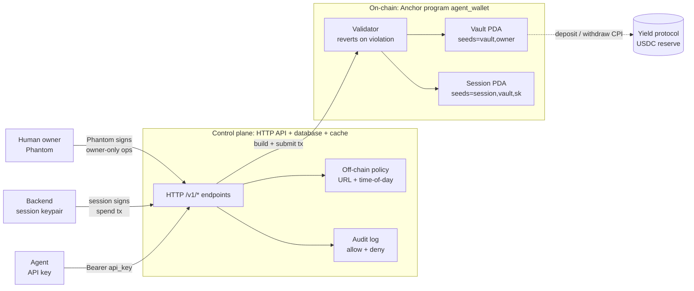
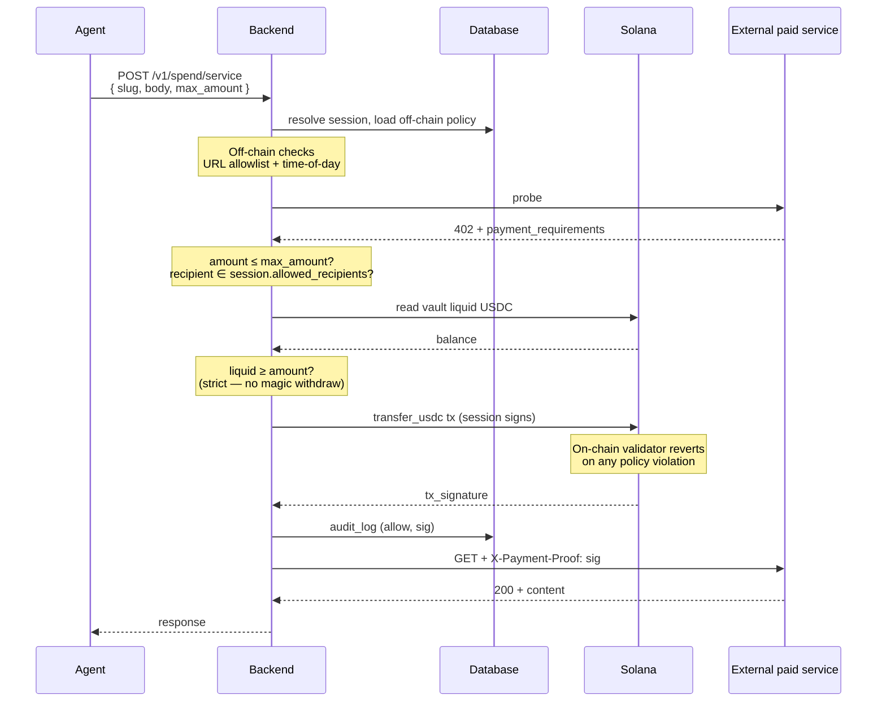

# Architecture

Klink is a non-custodial Solana smart-wallet for AI agents with on-chain policy enforcement. Three layers, three actors, hybrid policy, hard limits on-chain, rich rules off-chain, audit on-chain by default.

## Three actors, three blast radii

| Actor | Holds | Authority | If credential leaks |
|---|---|---|---|
| **Human owner** | Phantom keypair (on-device) | Master, configures policy, funds wallet, can revoke any session | Total loss (same as any Solana wallet, owner is the master) |
| **Backend** | Session keypair (encrypted at rest with AES-256-GCM) | Delegated, co-signs spend txs subject to on-chain policy | Bounded by `daily_cap` × time-to-revoke; restricted by recipient + program allowlists |
| **Agent** | Bearer API key only | None on-chain, talks to the backend over HTTP | Zero direct on-chain risk; worst case attacker operates within session bounds |

The trust boundary: the agent never crosses below the backend. The session keypair lives in the backend, never on the agent's machine. The owner key never leaves the human's device.

## The three layers

| Layer | Tech | Responsibility |
|---|---|---|
| **On-chain** (Anchor program `agent_wallet`) | Rust, Anchor 1.0, Solana 3.x | Custody of USDC. Hard policy floor, reverts spends that violate `max_per_tx`, `daily_cap`, recipient allowlist, expiry, `max_deployed_fraction_bp`. Hardcoded program IDs at every CPI site (SPL Token, yield protocol), adding a new protocol requires a program upgrade gated by the multisig upgrade authority. |
| **Control plane** (backend) | Node 20 / Bun, TypeScript, HTTP API, relational DB, in-memory cache | API surface, off-chain rich rules (URL allowlist, time-of-day), session-keypair signing, fiat-in treasury bridge, audit-log enrichment. Stateless, horizontally scalable. |
| **Actor edge** | Phantom (human), session keypair (backend), bearer API key (agent) | Authentication and tx signing entry points. Owner key never leaves the device. |

## What lives where

| Concern | Layer | Notes |
|---|---|---|
| USDC custody | On-chain | Vault PDA's USDC ATA |
| Hard policy (caps, allowlists, expiry, deployed-fraction) | On-chain | Vault + Session accounts |
| Rich policy (URL allowlist, time-of-day) | Off-chain | Off-chain policy store |
| Session keypair | Off-chain | Encrypted at rest with AES-256-GCM, master key from env |
| API key → wallet binding | Off-chain | Hashed (bcrypt/argon2) |
| Audit: on-chain events | On-chain | Solana tx history (free, immutable, queryable via any RPC) |
| Audit: off-chain decisions (allow/deny + reason) | Off-chain | Audit log |
| Treasury USDC float (fiat-in bridge) | Off-chain | Single hot wallet, capped at minimum viable for the current release |
| Curated paid-service routing | Off-chain | Proxy with curated catalog |

## Spend flow (the hot path)

The most common operation: an agent calls a paid service, the backend signs a spend tx subject to both off-chain (URL, time) and on-chain (caps, allowlist) policy.

Yield deposits and withdrawals follow the same pattern via dedicated instructions, which CPI to the yield protocol with hardcoded program ID and enforce `max_deployed_fraction_bp` on-chain.

## Why hybrid (and not pure on-chain or pure off-chain)

| Approach | Problem |
|---|---|
| **Pure on-chain** | Solana programs can't natively express "no spending between 22:00 and 06:00 UTC" without oracles or custom timekeeping. URL allowlists are off-chain by nature. |
| **Pure off-chain** | The whole point of a Solana-native primitive is trustless safety, if the backend is the only policy authority, the user has to trust the backend. Hybrid keeps the safety floor trustless and adds rich rules above it. |

The on-chain layer is the trustless guarantee. The off-chain layer is enrichment, convenient, but the worst case if the backend is compromised is bounded by what's already on-chain.

## Read next

* **Concepts**: [Vault](../concepts/vault.md) · [Sessions](../concepts/sessions.md) · [Policies](../concepts/policies.md) · [Budgets](../concepts/budgets.md) · [Audit Trail](../concepts/audit-trail.md) · [Yield](../concepts/yield.md)
* **[Risks & Disclosures](../resources/risks.md)**: what's not covered, what could go wrong
* **[Roadmap](../resources/roadmap.md)**: what's next
