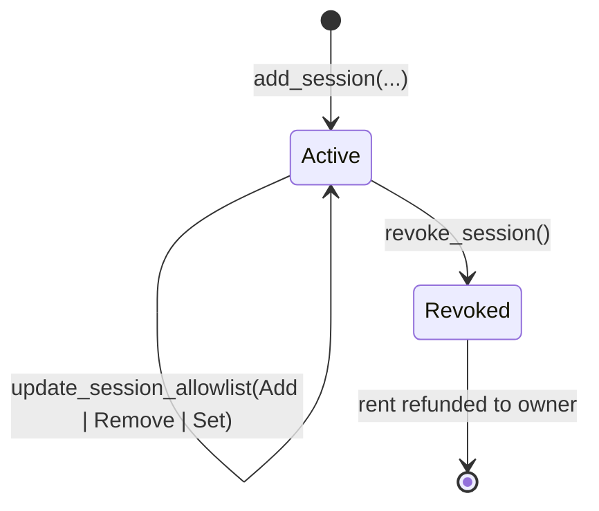

# Sessions

A **Session** is a per-agent on-chain account that delegates a *bounded* slice of the vault's authority. It encodes everything the program needs to validate an agent's spend without consulting the off-chain backend: who the recipient can be, how much per transaction, how much per day, when it expires, and which instructions it's allowed to invoke.

One session = one agent. An owner can have many sessions on the same vault.

## Account layout

```rust
struct Session {
    vault: Pubkey,
    session_pubkey: Pubkey,                       // backend-held keypair's public key
    max_per_tx: u64,                              // USDC base units
    daily_cap: u64,
    daily_spent: u64,                             // running tally; resets on rolling 24h window
    daily_window_start: i64,                      // unix; rolls every 86400s
    expiry: i64,                                  // 0 = never expires
    allowed_recipients: [Pubkey; 10],             // fixed-size; unused = Pubkey::default()
    allowed_recipients_count: u8,
    allowed_instructions: u32,                    // bitmap; see below
    bump: u8,
}
// Approximate size: 440 bytes  →  rent ~$0.50
```

## Seeds

```
seeds = ["session", vault.key(), session_pubkey.as_ref()]
```

The session PDA is derived from the vault and the session's public key. The session's keypair lives in the backend (encrypted at rest); the session's pubkey is what the on-chain account is keyed by.

## Allowed instructions (bitmap)

`allowed_instructions` is a 32-bit field where each bit gates a specific spending instruction:

| Bit | Instruction | What it lets the session do |
|---|---|---|
| 0 | `transfer_usdc` | Pay an address from `allowed_recipients` |
| 1 | `kamino_deposit` | Deposit USDC to the curated USDC reserve |
| 2 | `kamino_withdraw` | Withdraw USDC from the reserve back to the vault |
| 3 | reserved (swap, future) | — |
| 4–31 | reserved | — |

`allowed_instructions = 0b0000_0111` enables transfer + deposit + withdraw. `allowed_instructions = 0b0000_0001` is a transfer-only session. `allowed_instructions = 0` is a read-only session that cannot move funds at all.

The bitmap is one of the strongest blast-radius levers: if you don't trust an agent with yield, don't set bits 1 and 2.

## Why a *typed-instruction* bitmap (not a program-ID allowlist)

Every Klink instruction that does a CPI hardcodes the destination program ID:

* `transfer_usdc` → SPL Token Program (hardcoded)
* `kamino_deposit` / `kamino_withdraw` → curated yield protocol (hardcoded)

The wallet program will not dispatch to any other program for these operations. Adding a new protocol requires a program upgrade, gated by the multisig upgrade authority. The bitmap therefore lists *typed instructions* rather than *program addresses*, because the program ID is structural — not data.

## Lifecycle



* **add_session** (owner-signed) — registers a new session. Backend generates the keypair, encrypts the secret, builds the tx for the human's Phantom to sign.
* **update_session_allowlist** (owner-signed) — mutates `allowed_recipients` or `allowed_instructions` post-creation via `Add | Remove | Set` actions.
* **revoke_session** (owner-signed) — closes the session account, refunds rent. Works without the backend; the human can sign directly from Phantom in an emergency.

## Daily-cap rolling window

`daily_cap` is enforced over a **rolling 24-hour window**, not a calendar day. The window resets the first time a transfer fires after `now ≥ daily_window_start + 86400`:

```
if now >= daily_window_start + 86400:
    daily_spent = 0
    daily_window_start = now
assert daily_spent + amount <= daily_cap
daily_spent += amount
```

This avoids the "midnight burst" attack pattern where a compromised session waits for the calendar to flip and drains another full day's worth.

## Recipient allowlist

`allowed_recipients` is a **fixed array of 10 Pubkey slots**. Unused slots hold `Pubkey::default()`. The MVP does not support dynamic-size allowlists — adding an 11th recipient requires picking one to remove.

`allowed_recipients_count` tracks how many slots are filled; the program rejects any recipient not in the first `allowed_recipients_count` entries.

## Account-creation cost

| Account | One-time rent | Refundable on close |
|---|---|---|
| Session account | ~$0.50 | Yes (on `revoke_session`) |

Sponsorable by the backend at creation time. Refunded to the vault owner on revoke.

## What the session does NOT contain

* **No URL allowlist.** That's off-chain ([Policies](policies.md) → off-chain rich rules).
* **No time-of-day window.** That's off-chain too.
* **No API key.** The API key lives in the backend, hashed at rest; it resolves to a session at request time.

## Read next

* [Policies](policies.md) — how on-chain limits compose with off-chain rules
* [Budgets](budgets.md) — `max_per_tx`, `daily_cap`, `max_deployed_fraction_bp`
