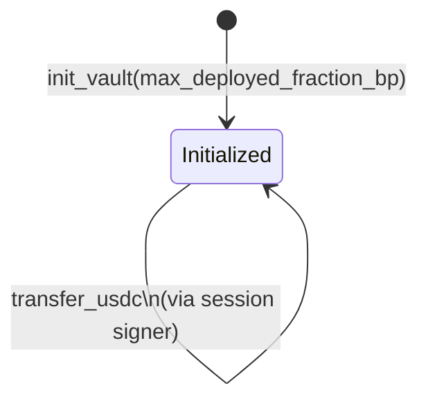

# Vault

The **Vault** is a Program-Derived Address (PDA) owned by Klink's Anchor program. One per human. It holds USDC via its associated token account (ATA), and it's the on-chain anchor for every per-wallet policy decision.

## Account layout

```rust
struct Vault {
    owner: Pubkey,                   // human's Phantom pubkey — master authority
    max_deployed_fraction_bp: u16,   // basis points; e.g. 8000 = 80%
    deployed_amount: u64,            // current yield deposit (USDC base units)
    bump: u8,
}
// Approximate size: 80 bytes  →  rent ~$0.20 at $200/SOL
```

## Seeds

```
seeds = ["vault", owner.key()]
```

The PDA is fully derivable from the owner's Phantom pubkey. There is no global registry — given any owner pubkey, anyone can compute the vault address.

## Fields

| Field | Type | Meaning |
|---|---|---|
| `owner` | `Pubkey` | Human's Phantom pubkey. Master authority — only this key can run owner-only instructions (`set_max_deployed_fraction`, `add_session`, `revoke_session`, `update_session_allowlist`). |
| `max_deployed_fraction_bp` | `u16` | Basis points (0–10000). Hard cap on the fraction of total USDC that may sit in yield at any moment. Adjustable by owner via `set_max_deployed_fraction`. |
| `deployed_amount` | `u64` | Current USDC deposited in the yield protocol, in base units (1 USDC = 1_000_000). Updated atomically on every `kamino_deposit` / `kamino_withdraw`. |
| `bump` | `u8` | PDA bump byte. |

## USDC custody

The vault doesn't hold USDC directly. Like every SPL-token holder, it has an Associated Token Account at a derived address:

```
spl_associated_token_account.get_associated_token_address(
    wallet_address: vault_pda,
    token_mint_address: USDC_MINT,
)
```

USDC sent to that ATA is owned (in the SPL-token sense) by the vault PDA, which means only the program can move it — and the program only moves it when called via one of its signed instructions.

## Account-creation cost

| Account | One-time rent | Refundable on close |
|---|---|---|
| Vault PDA | ~$0.20 | Yes |
| Vault USDC ATA | ~$0.50 | Yes |

Both costs are sponsorable by the backend at creation time.

## Lifecycle



The vault has no terminal state — there is no "close vault" instruction. The owner key is the master authority for the lifetime of the vault.

## What the vault does NOT contain

- **No session list.** Sessions live in their own per-session PDA accounts ([Sessions](sessions.md)).
- **No URL allowlist.** That's off-chain ([Policies](policies.md) → off-chain rich rules).
- **No history.** That's the Solana transaction log ([Audit Trail](audit-trail.md)).

## Read next

- [Sessions](sessions.md) — the per-agent account that delegates authority
- [Budgets](budgets.md) — how `max_deployed_fraction_bp` interacts with yield
