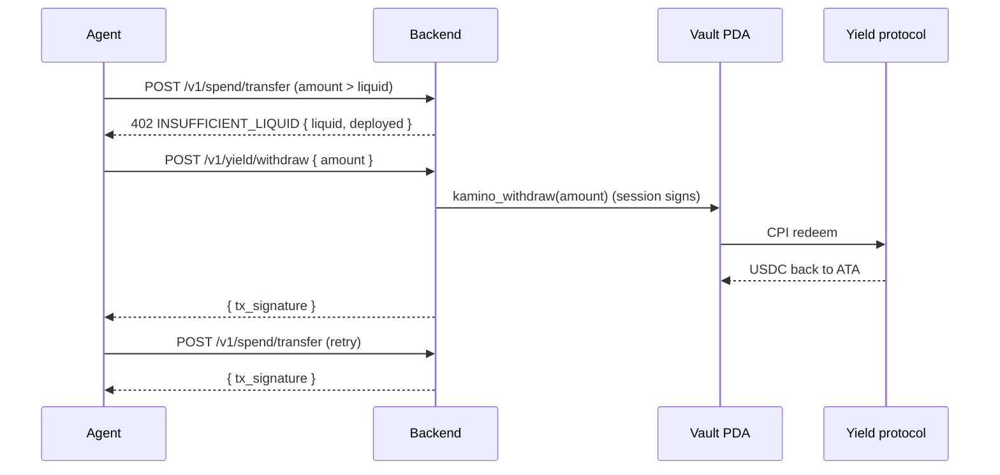

# Yield

Klink integrates with a curated USDC reserve as the initial yield source. Two design choices distinguish it from naïve "auto-yield wallets":

1. **Manual only.** No background workers move user funds. Every deposit and every withdrawal is initiated by an explicit call from the human (dashboard JWT) or the agent (API key, if `allowed_instructions` bit 1/2 are set).
2. **On-chain deployment cap.** The vault enforces `max_deployed_fraction_bp` at the program level. No caller: not the human, not the agent, not an attacker with a leaked session, can over-deploy funds beyond that cap.

## Why manual

The current release explicitly excludes auto-rebalance, auto-deposit on idle, and auto-withdraw before spend. Reasons:

| Concern | Manual approach |
|---|---|
| **Trust surface** | A background cron acting on user funds is a credential the wallet has to hold somewhere. Manual avoids it. |
| **Liquidity surprises** | Auto-withdraw before spend introduces a 2-tx critical path (withdraw + transfer) and exposes Kamino utilization stress. Manual makes liquidity explicit. |
| **Atomic-bundle complexity** | Bundling withdraw + transfer into one Solana tx is tight against the 1232-byte limit; deferred to v2. |
| **Audit clarity** | Every deposit and withdrawal is a deliberate, attributable action. |

## Instructions

| Instruction | Signer | Pre-flight (on-chain) | Effect |
|---|---|---|---|
| `kamino_deposit(amount)` | session OR owner | `(deployed + amount) × 10000 / total ≤ max_deployed_fraction_bp` | CPI to the yield protocol with hardcoded program ID; updates `vault.deployed_amount` |
| `kamino_withdraw(amount)` | session OR owner | `amount ≤ vault.deployed_amount` | CPI to the yield protocol; decrements `deployed_amount`; returns the protocol's actual withdrawn amount (may be partial under utilization stress) |

Both instructions hardcode the protocol's program ID at the CPI invocation site. The wallet program will not dispatch to any other program for yield operations. Adding a second yield protocol requires a program upgrade, gated by the multisig upgrade authority.

## Spend-time liquidity is strict

Klink does **not** magic-withdraw before spend. The pre-flight on every spend is:

```
liquid = on-chain USDC ATA balance
if liquid < amount:
    return 402 INSUFFICIENT_LIQUID { liquid, deployed, deficit }
```

The caller, agent or human, has to explicitly call `/v1/yield/withdraw` first if deployed funds are needed. This is documented behavior, not a bug.



## Reading the position

```
GET /v1/yield/position
  → reads vault.deployed_amount on-chain
  → queries the yield protocol for accrued amount
  ← { deployed, accrued, total_balance }
```

`deployed` is the principal (USDC base units). `accrued` is the yield earned since last withdraw. `total_balance` is the sum, in USDC base units.

## Failure modes

| Failure | What happens | Mitigation |
|---|---|---|
| Yield protocol down or contract upgrade | Can't withdraw deployed funds until the protocol recovers | Disclosed at deploy time; multi-protocol yield is on the [Roadmap](../resources/roadmap.md) |
| Yield utilization stress | `kamino_withdraw` returns less than requested | Backend returns `409 PARTIAL_LIQUIDITY { available }`; caller retries smaller amount or waits |
| Over-deployment attempt | Program reverts the tx | `max_deployed_fraction_bp` enforced on-chain at deposit time |

## What yield does NOT include

* **No auto-deposit**: idle USDC stays idle until you explicitly deposit it.
* **No auto-rebalance across markets**: single hardcoded reserve in the current release.
* **No multi-protocol allocation**: one well-tested integration first; additional protocols are on the [Roadmap](../resources/roadmap.md).
* **No yield split between users**: the deployed amount is per-vault; accrued yield belongs to the vault's owner.

## Read next

* [Vault](vault.md): `max_deployed_fraction_bp` lives here
* [Roadmap](../resources/roadmap.md): when auto-yield and multi-protocol arrive
