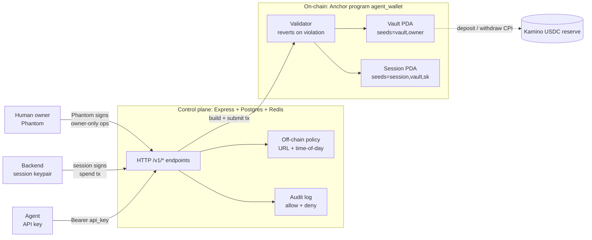
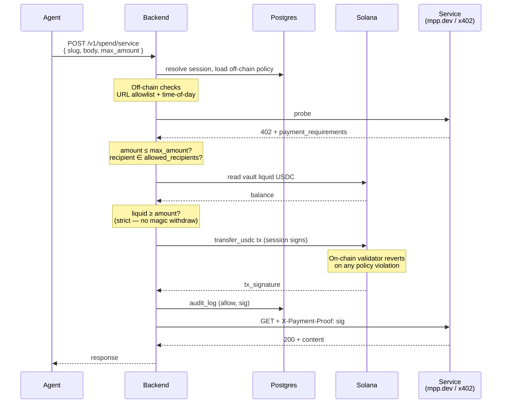

# How it works

Klink in one page. For full implementation detail, see the [internal design spec](https://github.com/manjeetsharma0796/klink/blob/main/docs/specs/2026-04-28-agent-wallet-design.md).

## Three actors

| Actor | Holds | Lives where |
|---|---|---|
| **Human owner** | Phantom keypair | The human's device |
| **Backend** | Session keypair | Postgres, AES-256-GCM at rest |
| **Agent** | Bearer API key | The agent's environment (`AGENT_API_KEY=…`) |

The trust boundary is the backend. **The agent never crosses below it** — it talks HTTP to the backend, never directly to Solana, and never holds a Solana keypair.

## Three layers

| Layer | Tech | Responsibility |
|---|---|---|
| **On-chain** (Anchor `agent_wallet`) | Rust, Anchor 1.0, Solana 3.x | USDC custody. Hard policy floor — reverts on cap, allowlist, expiry, or deployed-fraction violations. Hardcoded program IDs at every CPI site. |
| **Control plane** (backend) | Node 20 / Bun, TypeScript, Express, Drizzle, Postgres 16, Redis 7 | API surface, off-chain rich rules (URL allowlist, time-of-day), session-keypair signing, treasury bridge for fiat-in, audit-log enrichment. Stateless. |
| **Edge** | Phantom (human), session keypair (backend), bearer API key (agent) | Authentication and tx-signing entry points. |

## Three blast radii

| Credential | If leaked | Recovery |
|---|---|---|
| Owner key (Phantom) | Total loss — same as any Solana wallet | None at protocol level (the owner is the master) |
| Session keypair | Bounded — capped by `daily_cap × time-to-revoke`; restricted by recipient + program allowlists | Owner signs `revoke_session` from Phantom — works without the backend |
| API key | Zero direct on-chain risk — worst case attacker operates within session bounds | Backend disables the API key (immediate) |

## The spend hot path

The most common operation: an agent calls a paid service, the backend signs a spend tx subject to both off-chain (URL, time) and on-chain (caps, allowlist) policy.

Yield deposits and withdrawals follow the same shape via `kamino_deposit` / `kamino_withdraw`, which CPI to Kamino with hardcoded program ID and enforce `max_deployed_fraction_bp` on-chain.

## Owner ops use Phantom

Every owner-authority action (`init_vault`, `set_max_deployed_fraction`, `add_session`, `revoke_session`, `update_session_allowlist`) is a **build-tx-then-sign** flow: the backend builds the unsigned transaction, the human's Phantom signs it. **The backend never holds the owner's key.**

## What lives where

| Concern | Layer |
|---|---|
| USDC custody | On-chain (Vault PDA's USDC ATA) |
| Hard policy (caps, allowlists, expiry, deployed-fraction) | On-chain (Vault + Session accounts) |
| Rich policy (URL allowlist, time-of-day) | Off-chain (Postgres) |
| Session keypair | Off-chain (Postgres, AES-256-GCM) |
| API key → wallet binding | Off-chain (Postgres, hashed) |
| Audit: on-chain events | On-chain (Solana tx history) |
| Audit: off-chain decisions (allow/deny + reason) | Off-chain (Postgres `audit_log`) |
| Treasury USDC float (fiat-in bridge) | Off-chain (single hot wallet) |

## Read next

* [Concepts → Overview](../concepts/overview.md) — the vocabulary
* [Architecture → System Overview](../architecture/overview.md) — fuller diagrams
* [What is Klink?](what-is-klink.md) — positioning and niche
