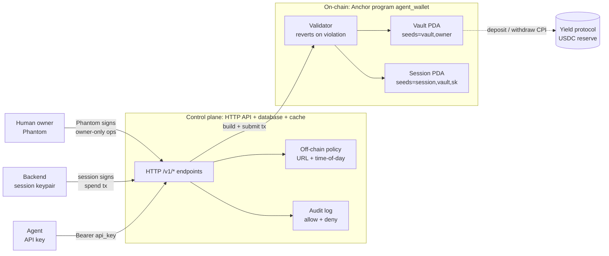
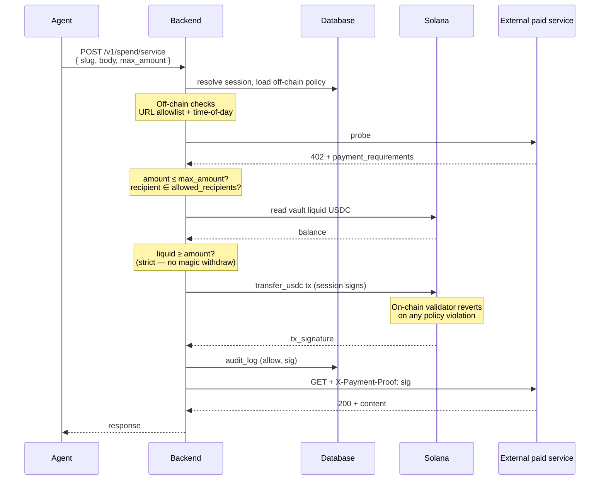

# Introduction

When an AI agent spends your money, three things should be true:

1. **You can't be drained beyond a cap.** Even if the agent is compromised, the loss is bounded by limits you set in advance.
2. **You can audit every action.** Every spend and every blocked attempt, with the same permanence as a bank statement.
3. **The agent's credentials can't break the rules.** "The agent leaked its key, then ran wild" should not be a category of failure.

Klink makes those true on Solana.

## How

A non-custodial smart-wallet for AI agents:

- The **human owner** holds a Phantom keypair. They configure policy, fund the wallet, and can revoke any session in seconds.
- The **backend** holds a session keypair (encrypted at rest) that co-signs every spend, subject to on-chain rules.
- The **agent** holds nothing but an HTTP API key — zero on-chain authority. Even if the agent is fully compromised, the worst it can do is operate within the session's bounds.

The rules — caps, allowlists, expiry, deployed-fraction — are enforced by an Anchor program on Solana. The chain reverts any spend that violates them. Off-chain, richer rules (URL allowlists, time-of-day windows) layer above.

Solana transaction history is the audit trail by default. Free to query, immutable, no log files to tamper with.

## Three actors

| Actor | Holds | Lives where |
|---|---|---|
| **Human owner** | Phantom keypair | The human's device |
| **Backend** | Session keypair | Encrypted at rest with AES-256-GCM |
| **Agent** | Bearer API key | The agent's environment (`AGENT_API_KEY=…`) |

The trust boundary is the backend. **The agent never crosses below it** — it talks HTTP to the backend, never directly to Solana, and never holds a Solana keypair.

## Three layers

| Layer | Tech | Responsibility |
|---|---|---|
| **On-chain** (Anchor `agent_wallet`) | Rust, Anchor 1.0, Solana 3.x | USDC custody. Hard policy floor — reverts on cap, allowlist, expiry, or deployed-fraction violations. Hardcoded program IDs at every CPI site. |
| **Control plane** (backend) | Node 20 / Bun, TypeScript, HTTP API, relational DB, in-memory cache | API surface, off-chain rich rules (URL allowlist, time-of-day), session-keypair signing, treasury bridge for fiat-in, audit-log enrichment. Stateless. |
| **Edge** | Phantom (human), session keypair (backend), bearer API key (agent) | Authentication and tx-signing entry points. |

## Three blast radii

| Credential | If leaked | Recovery |
|---|---|---|
| Owner key (Phantom) | Total loss — same as any Solana wallet | None at protocol level (the owner is the master) |
| Session keypair | Bounded — capped by `daily_cap × time-to-revoke`; restricted by recipient + program allowlists | Owner signs `revoke_session` from Phantom — works without the backend |
| API key | Zero direct on-chain risk — worst case attacker operates within session bounds | Backend disables the API key (immediate) |

## The spend hot path

The most common operation: an agent calls a paid service, the backend signs a spend tx subject to both off-chain (URL, time) and on-chain (caps, allowlist) policy.

Yield deposits and withdrawals follow the same shape via dedicated instructions, which CPI to the yield protocol with hardcoded program ID and enforce `max_deployed_fraction_bp` on-chain.

## Owner ops use Phantom

Every owner-authority action (create vault, set deployed-fraction cap, add session, revoke session, update session allowlist) is a **build-tx-then-sign** flow: the backend builds the unsigned transaction, the human's Phantom signs it. **The backend never holds the owner's key.**

## What you get

| You're building | Klink gives you |
|---|---|
| An agent that pays for APIs | Per-tx + per-day caps, recipient allowlist, time-of-day windows. Signed by a session keypair the agent never holds. |
| An agent that needs to be auditable | Solana tx history as source of truth — no log tampering, no selective deletion, queryable from any RPC. |
| An agent with idle USDC | Manual deposits to a curated USDC reserve, with an on-chain over-deployment cap. |
| A team that needs revoke-on-incident | Owner-signed `revoke_session` from Phantom. ~5s, ~$0.0001. Works without the backend. |

## Why Solana

Klink's core idea — policy living *inside* the account — works because of how Solana is built:

- **Account model + PDAs.** A wallet that owns its policy is the natural pattern, not a workaround.
- **Cheap compute.** Running policy checks on every spend is feasible without per-tx fees blowing up.
- **Sub-cent fees.** Agents can do high-frequency micropayments and the cost still rounds to noise.
- **Fast finality.** Owner-revoked sessions take effect in seconds.

## Read next

- **[Quickstart](../getting-started/quickstart.md)** — hands-on walkthrough
- **[Concepts → Overview](../concepts/overview.md)** — vocabulary you'll see across these docs
- **[Architecture](../architecture/overview.md)** — fuller diagrams
- **[Roadmap](../resources/roadmap.md)** — what's available today, what's next
